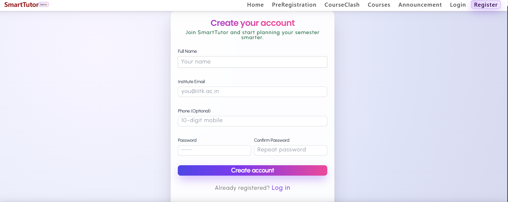
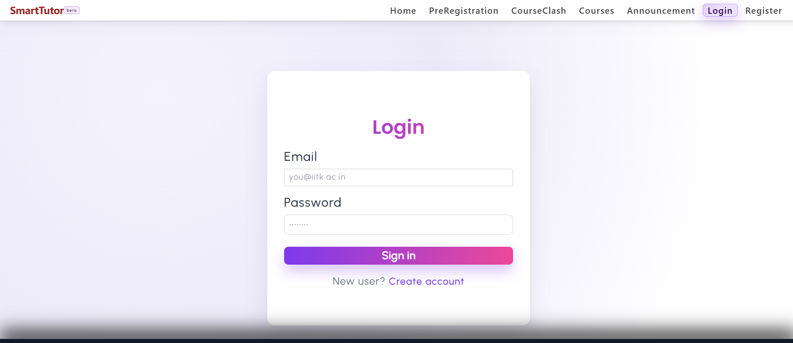
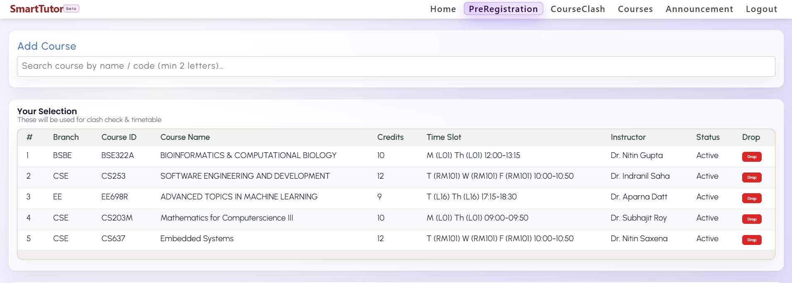
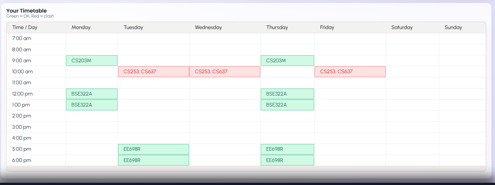

# 🎓 SmartTutor – Course Pre-Registration Platform

SmartTutor is a **full-stack web application** built using the **MERN stack (MongoDB, Express.js, React, Node.js)** that simulates the **IIT Kanpur Pre-Registration Portal**.

It allows students to **search, add, and drop courses**, automatically **generate a weekly timetable**, **detect time clashes**, and **view announcements** — all through a clean, responsive UI inspired by IITK student portals.

---

## 🚀 Features

- 🔐 **User Authentication** (JWT + Cookies)
- 📚 **Course Management**
  - Search courses
  - Add / Drop courses
- 📅 **Automatic Timetable Generation**
  - Clash detection
  - 🔴 Red = Clash, 🟢 Green = No Clash
- 📢 **Announcements Page** with styled cards
- 🌐 **Full-Stack Integration** (Frontend + Backend + Database)
- 🎨 **Modern & Responsive UI**

---

## 📸 Screenshots


### 📝 Registration Page


### 🔐 Login Page



### 📚 Course Pre-Registration


### 🗓️ Timetable with Clash Detection


---

## 🛠️ Tech Stack

- **Frontend:** React, CSS
- **Backend:** Node.js, Express.js
- **Database:** MongoDB
- **Authentication:** JWT, Cookies
- **State Management:** React Hooks

---

## ✅ Prerequisites

Make sure you have the following installed:

- Node.js **v14 or higher**
- MongoDB **v4.4 or higher**
- npm or yarn

---

## ⚙️ Installation & Setup

### 1️⃣ Clone the Repository

```bash
git clone https://github.com/surendrak21/SmartTutor.git
cd SmartTutor
```

2️⃣ Backend Setup
cd backend
npm install


Create a .env file in the backend directory:

PORT=5000
MONGODB_URI=mongodb://127.0.0.1:27017/smarttutor
SECRET_KEY= 000000


Run backend:

node app.js

3️⃣ Frontend Setup
cd ../Client
npm install
npm start


The frontend runs at: http://localhost:3000
The backend runs at: http://localhost:5000
---

##  API Documentation
 1. Authentication
 Signup

URL: /signup

Method: POST

Body:

{
  "name": "Kuldeep",
  "email": "test@example.com",
  "phone": "1234567890",
  "password": "password123",
  "cpassword": "password123"
}


Response:

{
  "message": "Successfully registered"
}

Login

URL: /login

Method: POST

Body:

{
  "email": "test@example.com",
  "password": "password123"
}


Response:

{
  "message": "Login successfully"
}

Logout

URL: /logout

Method: POST

Response:

"user logout"

2. Course Management
Get All Courses (Protected)

URL: /preregistration/courses

Method: GET

Response:

[
  {
    "branch": "CSE",
    "courseId": "CS253",
    "courseName": "Software Engineering and Development",
    "credits": 12,
    "time": "T (RM101) W (RM101) F (RM101) 10:00-10:50",
    "instructor": "Dr. Indranil Saha",
    "status": "Active"
  }
]

Add a Course

URL: /preregistration/courses

Method: POST

Body:

{
  "branch": "CSE",
  "courseId": "CS201A",
  "courseName": "Mathematics for CS I",
  "credits": 10,
  "time": "M (L01) Th (L01) 07:00-07:50",
  "instructor": "Dr. Rajat Mittal",
  "status": "Active"
}


Response: Newly added course

Delete a Course

URL: /preregistration/courses/:courseId

Method: DELETE

Response:

{
  "message": "Course dropped successfully"
}

3. Announcements (Protected)

URL: /announcement

Method: GET

Response:

[
  {
    "title": "Important Announcement",
    "description": "Lorem ipsum dolor sit amet...",
    "date": "2024-03-14"
  }
]

Data Models
User

name: String (required)

email: String (required, unique)

phone: String

password: String (hashed)

tokens: [JWT tokens]

Course

branch: String

courseId: String (unique)

courseName: String

credits: Number

time: String (with slot details)

instructor: String

status: String ("Active" / "Dropped")

---

## Error Handling

200: Success

201: Created

400: Bad Request

401: Unauthorized

404: Not Found

500: Internal Server Error

Example error response:

{
  "error": "Invalid credentials"
}
---

